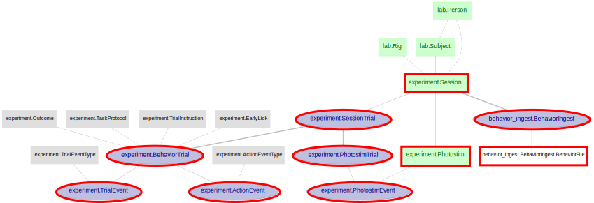
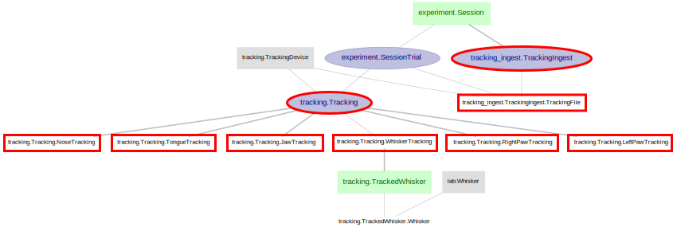

# MAP Data Flow

This document captures the sequence of data import, preprocessing, analysis, and
 figure generation implemented in the MAP pipeline. 

## `dj.Lookup` data
 

## Data Ingestion

Roughly speaking, the data being imported into the `Imported` tables of this pipeline
 belong to four primary categories, correspondingly accompanied by four "ingestion schemas" and scripts:

+ Behavior
    + schema: `ingest_behavior`
    + ingestion [script](../pipeline/ingest/behavior.py)
+ Tracking
    + schema: `ingest_tracking`
    + ingestion [script](../pipeline/ingest/tracking.py)
+ Ephys
    + schema: `ingest_ephys`
    + ingestion [script](../pipeline/ingest/ephys.py)
+ Histology
    + schema: `ingest_histology`
    + ingestion [script](../pipeline/ingest/ephys.py)

### Behavior Ingestion

The ingestion of behavior data is performed by the `BehaviorIngest`'s `make()` function.
 Each `make()` call perform the import for one session, determined by browsing the data folder
 and following the folder/file naming convention specified in the [Ingestion Instruction](./ingestion_instruction.md).
 
`BehaviorIngest` performs ingestion on a ***per-session*** basis,
 populating data into the tables outlined in red in the diagram below.

### Tracking Ingestion

Similarly, `TrackingIngest` performs ingestion on a ***per-session*** basis,
 populating data into the tables outlined in red in the diagram below.

The association of whisker tracking time series and the tracked whisker(s) are to be done as follow up manual insertion step.

### Ephys Ingestion

`EphysIngest` performs ingestion on a ***per-session*** basis,
 search for all Probe and Ephys data associated with that session,
 and populate data into the tables outlined in red in the diagram below.

The detailed steps are as followed:
1. Search data directory for clustering folder per probe - e.g. kilosort or jrclust
2. Per probe, performs:
    1. Read neuropixels meta file (*_ap.meta) for probe type, probe's serial number, and electrode configuration
    2. Insert new `ephys.ProbeInsertion`
    3. Read clustering results for clustering method, units, unit quality, spike times, waveforms, etc. 
    4. Insert new `ephys.Unit` for each unit
    5. Read quality control data (metrics.csv) if available, insert new:
        + `ephys.UnitStat`
        + `ephys.ClusterMetric`
        + `ephys.WaveformMetric`
    6. Read ***bitcode*** data file for trial numbering, start times, and "go-cue" onset
    7. Extract spike times per unit per trial, time alignment to "go-cue", and insert new `ephys.Unit.TrialSpike`
3. Insertion details are to be subsequently manually inserted by experimenters:
    + `ephys.ProbeInsertion.InsertionLocation`
    + `ephys.ProbeInsertion.RecordableBrainRegion`

### Histology Ingestion

`HistologyIngest` performs ingestion on a ***per-probe*** basis, populating electrodes' CCF locations and probe tracks.

## Analysis routine
 
The MAP pipeline is setup with a set of "workers" that will automatically
 perform processing/analysis on any newly available data in a parallely distributed fashion.

The insertion of new ephys data triggers several analysis routines. 

+ Computing unit's firing rate and ISI-violation (if quality control metrics not available) in `ephys.UnitStat`
+ Computing unit's cell type based on mean waveform in `ephys.UnitCellType`
+ Compute unit PSTH for all predefined trial condition (i.e. `psth.TrialCondition`) in `psth.UnitPSTH`.
 This is done for all units except for those with ***unit_quality*** of type "all"

+ Only when `ephys.ProbeInsertion.InsertionLocation` available, compute:
    + period selectivity per unit, in `psth.PeriodSelectivity`
    + overall selectivity per unit, in `psth.UnitSelectivity`

Automatic generation of report figures based on availability of upstream results

+ `report.ProjectLevelProbeTrack`
    + figure regeneration triggered upon changes in the total count of `histology.LabeledProbeTrack`
+ `report.SessionLevelProbeTrack`
    + figure regeneration triggered upon changes in the count of `histology.LabeledProbeTrack` for any particular session
+ `report.SessionLevelReport`
+ `report.SessionLevelCDReport`
    + only process Session with ***UnitSelectivity*** computation fully completed, and has ***RecordableBrainRegion*** present for all probe insertions
+ `report.ProbeLevelReport`
    + only process ***ProbeInsertion*** with ***UnitSelectivity*** computation fully completed 
+ `report.ProbeLevelPhotostimEffectReport`
    + only process ProbeInsertion with UnitPSTH computation (for all TrialCondition) fully completed
+ `report.UnitLevelEphysReport`
    + only process Units from probe that has ***InsertionLocation*** present
    + ignore units of `unit_quality` of type "all"
+ `report.UnitLevelTrackingReport`
    + only process Units from session with tracking available
    + ignore units of `unit_quality` of type "all"